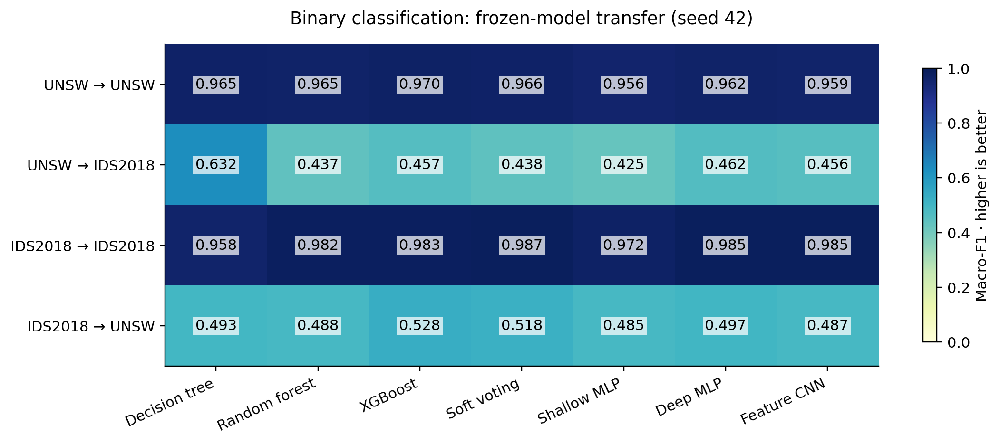

# Across-seed detector results

Mean and sample standard deviation across completed training/split seeds. Three seeds are planned; rows with fewer seeds are explicitly incomplete. These are descriptive variations, not population confidence intervals. Binary transfer uses the same frozen source model; native multiclass taxonomies differ across datasets.

| Task | Source | Target | Model | Seeds | Macro-F1 mean | SD |
| --- | --- | --- | --- | --- | --- | --- |
| binary | ids2018 | ids2018 | DecisionTree | 3 | 0.948660 | 0.014405 |
| binary | ids2018 | ids2018 | DeepMLP | 2 | 0.983989 | 0.001759 |
| binary | ids2018 | ids2018 | FeatureCNN | 2 | 0.971750 | 0.018474 |
| binary | ids2018 | ids2018 | RandomForest | 3 | 0.985209 | 0.002886 |
| binary | ids2018 | ids2018 | ShallowMLP | 3 | 0.973199 | 0.003821 |
| binary | ids2018 | ids2018 | SoftVoting | 3 | 0.978489 | 0.010316 |
| binary | ids2018 | ids2018 | XGBoost | 3 | 0.984998 | 0.002113 |
| binary | ids2018 | unsw | DecisionTree | 3 | 0.462416 | 0.031582 |
| binary | ids2018 | unsw | DeepMLP | 2 | 0.521374 | 0.034166 |
| binary | ids2018 | unsw | FeatureCNN | 2 | 0.484318 | 0.003656 |
| binary | ids2018 | unsw | RandomForest | 3 | 0.487553 | 0.000596 |
| binary | ids2018 | unsw | ShallowMLP | 3 | 0.443366 | 0.091664 |
| binary | ids2018 | unsw | SoftVoting | 3 | 0.509509 | 0.011181 |
| binary | ids2018 | unsw | XGBoost | 3 | 0.515659 | 0.023287 |
| binary | unsw | ids2018 | DecisionTree | 3 | 0.511758 | 0.115282 |
| binary | unsw | ids2018 | DeepMLP | 3 | 0.436423 | 0.025593 |
| binary | unsw | ids2018 | FeatureCNN | 3 | 0.427407 | 0.035863 |
| binary | unsw | ids2018 | RandomForest | 3 | 0.436624 | 0.004797 |
| binary | unsw | ids2018 | ShallowMLP | 3 | 0.457482 | 0.028274 |
| binary | unsw | ids2018 | SoftVoting | 3 | 0.444514 | 0.005765 |
| binary | unsw | ids2018 | XGBoost | 3 | 0.462947 | 0.004971 |
| binary | unsw | unsw | DecisionTree | 3 | 0.966201 | 0.009066 |
| binary | unsw | unsw | DeepMLP | 3 | 0.962679 | 0.009335 |
| binary | unsw | unsw | FeatureCNN | 3 | 0.962122 | 0.009976 |
| binary | unsw | unsw | RandomForest | 3 | 0.970096 | 0.006066 |
| binary | unsw | unsw | ShallowMLP | 3 | 0.864295 | 0.172195 |
| binary | unsw | unsw | SoftVoting | 3 | 0.967897 | 0.008925 |
| binary | unsw | unsw | XGBoost | 3 | 0.975027 | 0.004996 |
| multiclass | ids2018 | ids2018 | DecisionTree | 2 | 0.681962 | 0.046339 |
| multiclass | ids2018 | ids2018 | DeepMLP | 2 | 0.633294 | 0.063097 |
| multiclass | ids2018 | ids2018 | FeatureCNN | 2 | 0.570344 | 0.003051 |
| multiclass | ids2018 | ids2018 | RandomForest | 2 | 0.722383 | 0.049347 |
| multiclass | ids2018 | ids2018 | ShallowMLP | 2 | 0.588003 | 0.082923 |
| multiclass | ids2018 | ids2018 | SoftVoting | 2 | 0.709957 | 0.034509 |
| multiclass | ids2018 | ids2018 | XGBoost | 2 | 0.702491 | 0.049552 |
| multiclass | unsw | unsw | DecisionTree | 2 | 0.495623 | 0.006574 |
| multiclass | unsw | unsw | DeepMLP | 2 | 0.406050 | 0.067545 |
| multiclass | unsw | unsw | FeatureCNN | 2 | 0.407905 | 0.002606 |
| multiclass | unsw | unsw | RandomForest | 2 | 0.563278 | 0.029356 |
| multiclass | unsw | unsw | ShallowMLP | 2 | 0.385522 | 0.061731 |
| multiclass | unsw | unsw | SoftVoting | 2 | 0.550958 | 0.014233 |
| multiclass | unsw | unsw | XGBoost | 2 | 0.521181 | 0.017209 |

## Scope

Reported training uses 200000 sampled rows per source/seed. Extremely rare attack categories may be absent from training or test; per-class files and the data manifest retain that support information. Timing is not a controlled benchmark and interrupted neural fits can have segment-only timing.

The heatmap shows seed 42 only; use the table above for across-seed variation.
