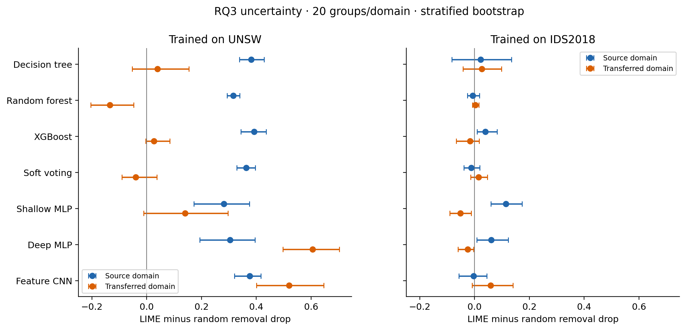
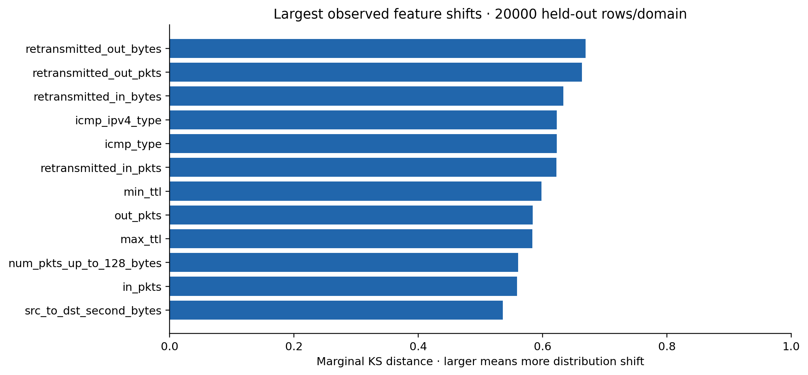
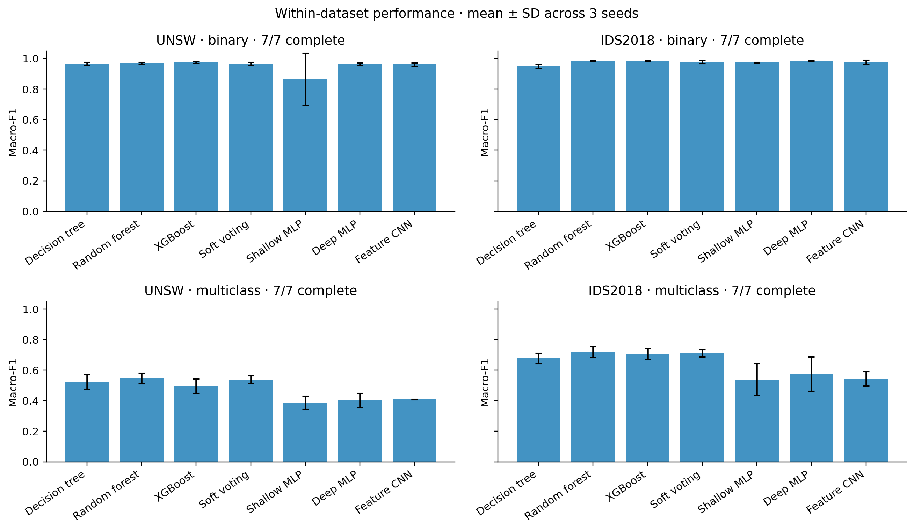

# Expanded study: measured results

Complete detector matrix: 126 completed evaluation cells. Planned classical/neural matrix: 84 fitted configurations, 126 evaluation cells. LLM and RQ3 results are reported separately. No thesis report is generated.

Training uses capped samples after global encoded-feature group partitioning. Source-only preprocessing; frozen binary models are evaluated within and across datasets. Multiclass taxonomies remain dataset-specific. One seed is not a final multi-seed estimate.

| Task | Source | Target | Seed | Model | N | Macro-F1 | Balanced accuracy | False alarm rate |
| --- | --- | --- | --- | --- | --- | --- | --- | --- |
| binary | ids2018 | ids2018 | 7 | DecisionTree | 80000 | 0.955669 | 0.972521 | 0.016601 |
| binary | ids2018 | unsw | 7 | DecisionTree | 80000 | 0.430003 | 0.469796 | 0.291447 |
| binary | ids2018 | ids2018 | 7 | DeepMLP | 80000 | 0.982746 | 0.975305 | 0.001630 |
| binary | ids2018 | unsw | 7 | DeepMLP | 80000 | 0.545533 | 0.528685 | 0.001814 |
| binary | ids2018 | ids2018 | 7 | FeatureCNN | 80000 | 0.958687 | 0.946795 | 0.005501 |
| binary | ids2018 | unsw | 7 | FeatureCNN | 80000 | 0.481733 | 0.477047 | 0.052921 |
| binary | ids2018 | ids2018 | 7 | RandomForest | 80000 | 0.987242 | 0.978328 | 0.000128 |
| binary | ids2018 | unsw | 7 | RandomForest | 80000 | 0.486873 | 0.488086 | 0.024267 |
| binary | ids2018 | ids2018 | 7 | ShallowMLP | 80000 | 0.970510 | 0.972275 | 0.007585 |
| binary | ids2018 | unsw | 7 | ShallowMLP | 80000 | 0.338279 | 0.282689 | 0.480655 |
| binary | ids2018 | ids2018 | 7 | SoftVoting | 80000 | 0.982112 | 0.978826 | 0.003147 |
| binary | ids2018 | unsw | 7 | SoftVoting | 80000 | 0.513927 | 0.510764 | 0.003899 |
| binary | ids2018 | ids2018 | 7 | XGBoost | 80000 | 0.985141 | 0.979327 | 0.001616 |
| binary | ids2018 | unsw | 7 | XGBoost | 80000 | 0.529778 | 0.519148 | 0.000283 |
| binary | ids2018 | ids2018 | 42 | DecisionTree | 80000 | 0.958219 | 0.971669 | 0.016703 |
| binary | ids2018 | unsw | 42 | DecisionTree | 80000 | 0.493095 | 0.494467 | 0.074003 |
| binary | ids2018 | ids2018 | 42 | DeepMLP | 80000 | 0.985233 | 0.977544 | 0.000994 |
| binary | ids2018 | unsw | 42 | DeepMLP | 80000 | 0.497215 | 0.502600 | 0.002792 |
| binary | ids2018 | ids2018 | 42 | FeatureCNN | 80000 | 0.984814 | 0.977828 | 0.001369 |
| binary | ids2018 | unsw | 42 | FeatureCNN | 80000 | 0.486904 | 0.485450 | 0.050080 |
| binary | ids2018 | ids2018 | 42 | RandomForest | 80000 | 0.981906 | 0.977482 | 0.003098 |
| binary | ids2018 | unsw | 42 | RandomForest | 80000 | 0.487807 | 0.492940 | 0.016118 |
| binary | ids2018 | ids2018 | 42 | ShallowMLP | 80000 | 0.971515 | 0.973924 | 0.008517 |
| binary | ids2018 | unsw | 42 | ShallowMLP | 80000 | 0.484965 | 0.482527 | 0.072574 |
| binary | ids2018 | ids2018 | 42 | SoftVoting | 80000 | 0.986505 | 0.978874 | 0.000692 |
| binary | ids2018 | unsw | 42 | SoftVoting | 80000 | 0.517806 | 0.513925 | 0.000455 |
| binary | ids2018 | ids2018 | 42 | XGBoost | 80000 | 0.982817 | 0.977807 | 0.002637 |
| binary | ids2018 | unsw | 42 | XGBoost | 80000 | 0.528419 | 0.519599 | 0.000429 |
| binary | ids2018 | ids2018 | 1337 | DecisionTree | 80000 | 0.932092 | 0.938790 | 0.018632 |
| binary | ids2018 | unsw | 1337 | DecisionTree | 80000 | 0.464152 | 0.479804 | 0.203680 |
| binary | ids2018 | ids2018 | 1337 | DeepMLP | 80000 | 0.984675 | 0.976543 | 0.000963 |
| binary | ids2018 | unsw | 1337 | DeepMLP | 80000 | 0.506578 | 0.507577 | 0.011528 |
| binary | ids2018 | ids2018 | 1337 | FeatureCNN | 80000 | 0.982852 | 0.975926 | 0.001771 |
| binary | ids2018 | unsw | 1337 | FeatureCNN | 80000 | 0.487347 | 0.489488 | 0.034897 |
| binary | ids2018 | ids2018 | 1337 | RandomForest | 80000 | 0.986479 | 0.977198 | 0.000184 |
| binary | ids2018 | unsw | 1337 | RandomForest | 80000 | 0.487980 | 0.499948 | 0.000105 |
| binary | ids2018 | ids2018 | 1337 | ShallowMLP | 80000 | 0.977572 | 0.973884 | 0.004052 |
| binary | ids2018 | unsw | 1337 | ShallowMLP | 80000 | 0.506854 | 0.506645 | 0.042740 |
| binary | ids2018 | ids2018 | 1337 | SoftVoting | 80000 | 0.966849 | 0.944883 | 0.000184 |
| binary | ids2018 | unsw | 1337 | SoftVoting | 80000 | 0.496794 | 0.504175 | 0.000721 |
| binary | ids2018 | ids2018 | 1337 | XGBoost | 80000 | 0.987036 | 0.977923 | 0.000113 |
| binary | ids2018 | unsw | 1337 | XGBoost | 80000 | 0.488781 | 0.500335 | 0.000131 |
| binary | unsw | ids2018 | 7 | DecisionTree | 80000 | 0.401976 | 0.379544 | 0.269125 |
| binary | unsw | unsw | 7 | DecisionTree | 80000 | 0.957647 | 0.988909 | 0.004645 |
| binary | unsw | ids2018 | 7 | DeepMLP | 80000 | 0.435601 | 0.666036 | 0.587941 |
| binary | unsw | unsw | 7 | DeepMLP | 80000 | 0.953696 | 0.996473 | 0.005739 |
| binary | unsw | ids2018 | 7 | FeatureCNN | 80000 | 0.438910 | 0.671139 | 0.584709 |
| binary | unsw | unsw | 7 | FeatureCNN | 80000 | 0.954451 | 0.996525 | 0.005636 |
| binary | unsw | ids2018 | 7 | RandomForest | 80000 | 0.441039 | 0.439460 | 0.140311 |
| binary | unsw | unsw | 7 | RandomForest | 80000 | 0.969219 | 0.997077 | 0.003654 |
| binary | unsw | ids2018 | 7 | ShallowMLP | 80000 | 0.473504 | 0.614919 | 0.466485 |
| binary | unsw | unsw | 7 | ShallowMLP | 80000 | 0.665681 | 0.952193 | 0.095176 |
| binary | unsw | ids2018 | 7 | SoftVoting | 80000 | 0.448813 | 0.452131 | 0.113701 |
| binary | unsw | unsw | 7 | SoftVoting | 80000 | 0.959759 | 0.991166 | 0.004516 |
| binary | unsw | ids2018 | 7 | XGBoost | 80000 | 0.464265 | 0.479459 | 0.053972 |
| binary | unsw | unsw | 7 | XGBoost | 80000 | 0.975726 | 0.982002 | 0.001801 |
| binary | unsw | ids2018 | 42 | DecisionTree | 80000 | 0.631847 | 0.672656 | 0.170474 |
| binary | unsw | unsw | 42 | DecisionTree | 80000 | 0.965252 | 0.992280 | 0.005117 |
| binary | unsw | ids2018 | 42 | DeepMLP | 80000 | 0.462417 | 0.683662 | 0.573491 |
| binary | unsw | unsw | 42 | DeepMLP | 80000 | 0.962009 | 0.996615 | 0.006104 |
| binary | unsw | ids2018 | 42 | FeatureCNN | 80000 | 0.456107 | 0.663075 | 0.571315 |
| binary | unsw | unsw | 42 | FeatureCNN | 80000 | 0.958516 | 0.994403 | 0.006533 |
| binary | unsw | ids2018 | 42 | RandomForest | 80000 | 0.437312 | 0.438909 | 0.141218 |
| binary | unsw | unsw | 42 | RandomForest | 80000 | 0.964517 | 0.994922 | 0.005494 |
| binary | unsw | ids2018 | 42 | ShallowMLP | 80000 | 0.424836 | 0.566497 | 0.561098 |
| binary | unsw | unsw | 42 | ShallowMLP | 80000 | 0.955505 | 0.996043 | 0.007247 |
| binary | unsw | ids2018 | 42 | SoftVoting | 80000 | 0.437963 | 0.443831 | 0.121950 |
| binary | unsw | unsw | 42 | SoftVoting | 80000 | 0.966490 | 0.992544 | 0.004922 |
| binary | unsw | ids2018 | 42 | XGBoost | 80000 | 0.457450 | 0.475265 | 0.061062 |
| binary | unsw | unsw | 42 | XGBoost | 80000 | 0.969719 | 0.974980 | 0.002753 |
| binary | unsw | ids2018 | 1337 | DecisionTree | 80000 | 0.501452 | 0.590300 | 0.366465 |
| binary | unsw | unsw | 1337 | DecisionTree | 80000 | 0.975704 | 0.991938 | 0.004118 |
| binary | unsw | ids2018 | 1337 | DeepMLP | 80000 | 0.411251 | 0.604136 | 0.595081 |
| binary | unsw | unsw | 1337 | DeepMLP | 80000 | 0.972330 | 0.997019 | 0.005429 |
| binary | unsw | ids2018 | 1337 | FeatureCNN | 80000 | 0.387203 | 0.528423 | 0.591779 |
| binary | unsw | unsw | 1337 | FeatureCNN | 80000 | 0.973400 | 0.997003 | 0.005193 |
| binary | unsw | ids2018 | 1337 | RandomForest | 80000 | 0.431520 | 0.424321 | 0.170991 |
| binary | unsw | unsw | 1337 | RandomForest | 80000 | 0.976553 | 0.996443 | 0.004446 |
| binary | unsw | ids2018 | 1337 | ShallowMLP | 80000 | 0.474106 | 0.596879 | 0.446378 |
| binary | unsw | unsw | 1337 | ShallowMLP | 80000 | 0.971699 | 0.996953 | 0.005561 |
| binary | unsw | ids2018 | 1337 | SoftVoting | 80000 | 0.446765 | 0.448870 | 0.119770 |
| binary | unsw | unsw | 1337 | SoftVoting | 80000 | 0.977442 | 0.993250 | 0.003895 |
| binary | unsw | ids2018 | 1337 | XGBoost | 80000 | 0.467126 | 0.489702 | 0.026538 |
| binary | unsw | unsw | 1337 | XGBoost | 80000 | 0.979637 | 0.984626 | 0.002466 |
| multiclass | ids2018 | ids2018 | 7 | DecisionTree | 80000 | 0.649195 | 0.718171 | 0.186259 |
| multiclass | ids2018 | ids2018 | 7 | DeepMLP | 80000 | 0.677910 | 0.745594 | 0.074969 |
| multiclass | ids2018 | ids2018 | 7 | FeatureCNN | 80000 | 0.572502 | 0.735876 | 0.066704 |
| multiclass | ids2018 | ids2018 | 7 | RandomForest | 80000 | 0.757277 | 0.755370 | 0.020061 |
| multiclass | ids2018 | ids2018 | 7 | ShallowMLP | 80000 | 0.646638 | 0.748046 | 0.219236 |
| multiclass | ids2018 | ids2018 | 7 | SoftVoting | 80000 | 0.685556 | 0.717135 | 0.006039 |
| multiclass | ids2018 | ids2018 | 7 | XGBoost | 80000 | 0.667453 | 0.700222 | 0.003020 |
| multiclass | ids2018 | ids2018 | 42 | DecisionTree | 80000 | 0.714728 | 0.749833 | 0.293851 |
| multiclass | ids2018 | ids2018 | 42 | DeepMLP | 80000 | 0.588678 | 0.730051 | 0.043797 |
| multiclass | ids2018 | ids2018 | 42 | FeatureCNN | 80000 | 0.568187 | 0.732261 | 0.136419 |
| multiclass | ids2018 | ids2018 | 42 | RandomForest | 80000 | 0.687490 | 0.730165 | 0.029472 |
| multiclass | ids2018 | ids2018 | 42 | ShallowMLP | 80000 | 0.529367 | 0.730141 | 0.488680 |
| multiclass | ids2018 | ids2018 | 42 | SoftVoting | 80000 | 0.734358 | 0.731579 | 0.004093 |
| multiclass | ids2018 | ids2018 | 42 | XGBoost | 80000 | 0.737529 | 0.731315 | 0.000288 |
| multiclass | ids2018 | ids2018 | 1337 | DecisionTree | 80000 | 0.668605 | 0.758266 | 0.134690 |
| multiclass | ids2018 | ids2018 | 1337 | DeepMLP | 80000 | 0.455018 | 0.730096 | 0.532496 |
| multiclass | ids2018 | ids2018 | 1337 | FeatureCNN | 80000 | 0.490662 | 0.701873 | 0.025306 |
| multiclass | ids2018 | ids2018 | 1337 | RandomForest | 80000 | 0.708784 | 0.765042 | 0.027615 |
| multiclass | ids2018 | ids2018 | 1337 | ShallowMLP | 80000 | 0.439082 | 0.742535 | 0.527311 |
| multiclass | ids2018 | ids2018 | 1337 | SoftVoting | 80000 | 0.713280 | 0.763326 | 0.005044 |
| multiclass | ids2018 | ids2018 | 1337 | XGBoost | 80000 | 0.712876 | 0.750275 | 0.000128 |
| multiclass | unsw | unsw | 7 | DecisionTree | 80000 | 0.500272 | 0.679792 | 0.005288 |
| multiclass | unsw | unsw | 7 | DeepMLP | 80000 | 0.358288 | 0.641799 | 0.096810 |
| multiclass | unsw | unsw | 7 | FeatureCNN | 80000 | 0.409748 | 0.650038 | 0.008698 |
| multiclass | unsw | unsw | 7 | RandomForest | 80000 | 0.584036 | 0.734238 | 0.005365 |
| multiclass | unsw | unsw | 7 | ShallowMLP | 80000 | 0.341872 | 0.643966 | 0.098264 |
| multiclass | unsw | unsw | 7 | SoftVoting | 80000 | 0.561022 | 0.684519 | 0.005018 |
| multiclass | unsw | unsw | 7 | XGBoost | 80000 | 0.533350 | 0.520460 | 0.001698 |
| multiclass | unsw | unsw | 42 | DecisionTree | 80000 | 0.490975 | 0.578049 | 0.005689 |
| multiclass | unsw | unsw | 42 | DeepMLP | 80000 | 0.453811 | 0.683338 | 0.009520 |
| multiclass | unsw | unsw | 42 | FeatureCNN | 80000 | 0.406063 | 0.614733 | 0.011650 |
| multiclass | unsw | unsw | 42 | RandomForest | 80000 | 0.542520 | 0.626799 | 0.005896 |
| multiclass | unsw | unsw | 42 | ShallowMLP | 80000 | 0.429173 | 0.619271 | 0.009987 |
| multiclass | unsw | unsw | 42 | SoftVoting | 80000 | 0.540894 | 0.596652 | 0.005351 |
| multiclass | unsw | unsw | 42 | XGBoost | 80000 | 0.509012 | 0.483947 | 0.002429 |
| multiclass | unsw | unsw | 1337 | DecisionTree | 80000 | 0.577837 | 0.671795 | 0.005285 |
| multiclass | unsw | unsw | 1337 | DeepMLP | 80000 | 0.389719 | 0.601199 | 0.008616 |
| multiclass | unsw | unsw | 1337 | FeatureCNN | 80000 | 0.406417 | 0.574712 | 0.009993 |
| multiclass | unsw | unsw | 1337 | RandomForest | 80000 | 0.513673 | 0.636686 | 0.004616 |
| multiclass | unsw | unsw | 1337 | ShallowMLP | 80000 | 0.388384 | 0.603504 | 0.010177 |
| multiclass | unsw | unsw | 1337 | SoftVoting | 80000 | 0.511850 | 0.588478 | 0.003987 |
| multiclass | unsw | unsw | 1337 | XGBoost | 80000 | 0.443094 | 0.454163 | 0.002125 |

## Analysis boundaries

Cross-dataset degradation measures the combined effect of domain differences under this protocol; it does not identify its cause. Explanation transfer requires separate stability, feature-ranking and random-controlled masking evaluations. Historical stability/faithfulness audit is in audit/ANALYSIS.md.

## Reproduction

Run `.venv-study/Scripts/python.exe -m study.run_training`, then `.venv-study/Scripts/python.exe -m study.summarize`. Only folders with complete.json contribute. Partial model outputs are excluded.

[Across-seed analysis](ACROSS_SEEDS.md) · [RQ3 analysis](xai/ANALYSIS.md) · [Calibration](calibration/ANALYSIS.md) · [Imbalance](imbalance/ANALYSIS.md) · [Figure index](figures/FIGURES.md)

<!-- generated-figures -->
## Figures and diagrams

Completed seed-42 binary detectors, 80000 test rows per target. Models are frozen across datasets. Single-seed evidence; not a final three-seed estimate. Blank cells indicate unavailable completed results.

[Scalable SVG](figures/01_detection_transfer.svg)

483 matched historical cases/model. Positive within-model random-adjusted associations do not imply the same ordering across model averages. Points may share feature groups; these plots do not establish significance or causation.

[Scalable SVG](figures/02_historical_stability_faithfulness.svg)

Completed RQ3 pilots only: 20 balanced unique feature groups per domain, three LIME seeds, one training seed. Arrows connect cohort means, not paired instances. Higher repeatability does not guarantee larger random-adjusted masking effects.

[Scalable SVG](figures/03_explanation_transfer.svg)

Temperature is fitted only on source validation. Negative cells indicate improved Brier score; positive cells indicate deterioration. Test labels are evaluation-only. Seed 42; 80000 cases per target.

[Scalable SVG](figures/04_calibration.svg)

Same seed-42 split and random-forest hyperparameters; only class weighting or training-row undersampling changes. Test prevalence remains untouched. This is a single-seed ablation.

[Scalable SVG](figures/05_imbalance.svg)

Instance-level means across three LIME seeds, then class-stratified bootstrap (5000 repeats). Intervals are conditional on a single trained model and small balanced cohort; not multiplicity-adjusted. Intervals crossing zero do not establish superiority over random masking.

[Scalable SVG](figures/08_rq3_uncertainty.svg)

Descriptive marginal shifts in encoded features. Class mixtures differ and features are correlated; no p-value or causal attribution is claimed. Zero fractions, medians and distances for all 39 features are preserved in shift/feature_shift.csv.

[Scalable SVG](figures/09_feature_shift.svg)

Only model groups with all three seeds contribute. Error bars are sample standard deviations across training/split seeds, not confidence intervals. Native multiclass label inventories differ by dataset; these panels are not cross-taxonomy transfer tests.

[Scalable SVG](figures/10_across_seed_variation.svg)

Counts are read from completion markers when regenerated. Unfinished includes pending or interrupted/running jobs; this chart does not independently verify live processes. LLM smoke tests do not count as full runs.

[Scalable SVG](figures/06_completion.svg)

Workflow diagram distinguishes model fitting, held-out evaluation and stored evidence. Source training provides LLM examples and explanation baselines; calibration fits source validation only. No target-test tuning.

[Scalable SVG](figures/07_workflow.svg)
