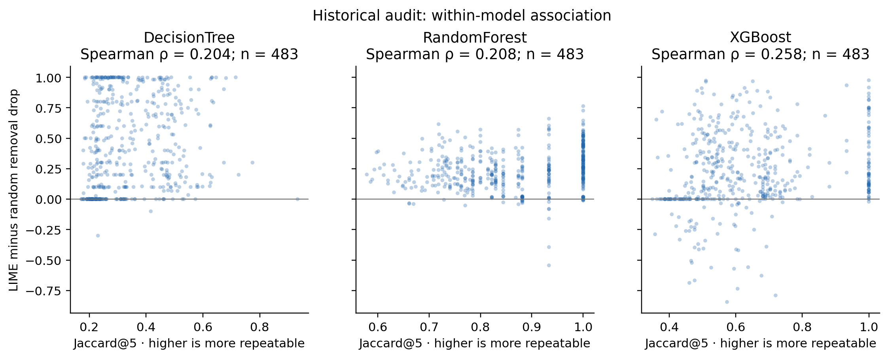
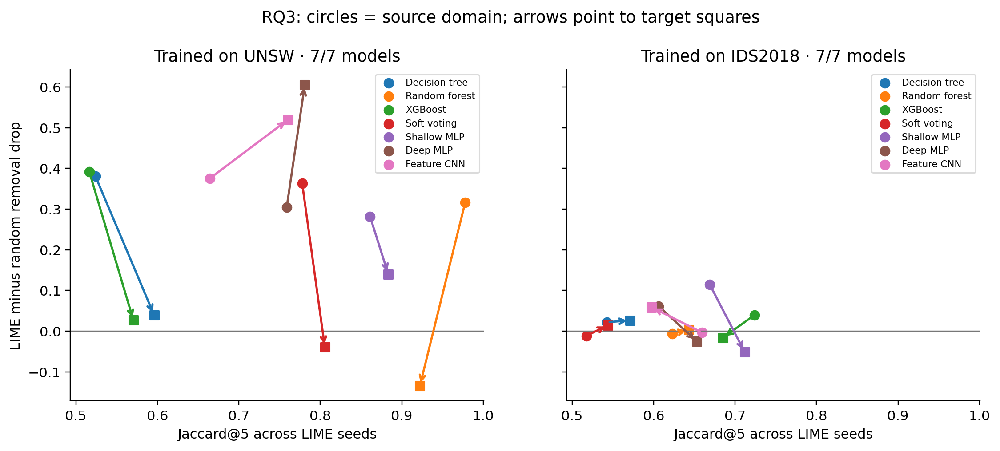
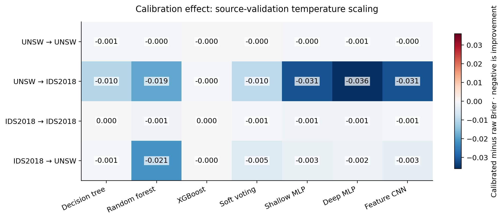
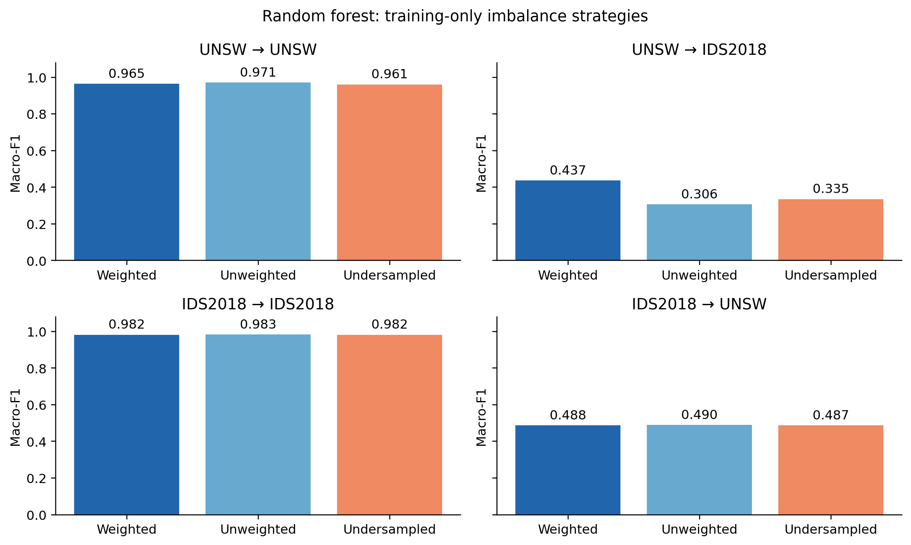
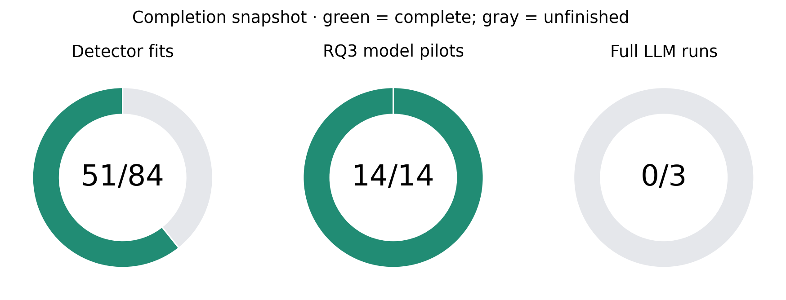
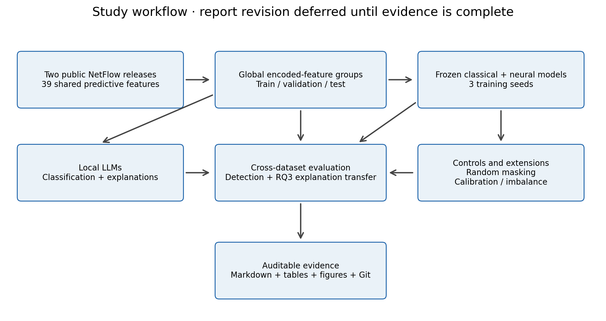

# Figures and diagrams

Regenerate with `.venv-study/Scripts/python.exe -m study.summarize` followed by `.venv-study/Scripts/python.exe -m study.make_figures`. PNG files are for viewing; SVG files are scalable publication assets. These figures do not modify the thesis report.

## 01_detection_transfer

Completed seed-42 binary detectors, 80000 test rows per target. Models are frozen across datasets. Single-seed evidence; not a final three-seed estimate. Blank cells indicate unavailable completed results.

[Scalable SVG](01_detection_transfer.svg)

## 02_historical_stability_faithfulness

483 matched historical cases/model. Positive within-model random-adjusted associations do not imply the same ordering across model averages. Points may share feature groups; these plots do not establish significance or causation.

[Scalable SVG](02_historical_stability_faithfulness.svg)

## 03_explanation_transfer

Completed RQ3 pilots only: 20 balanced unique feature groups per domain, three LIME seeds, one training seed. Arrows connect cohort means, not paired instances. Higher repeatability does not guarantee larger random-adjusted masking effects.

[Scalable SVG](03_explanation_transfer.svg)

## 04_calibration

Temperature is fitted only on source validation. Negative cells indicate improved Brier score; positive cells indicate deterioration. Test labels are evaluation-only. Seed 42; 80000 cases per target.

[Scalable SVG](04_calibration.svg)

## 05_imbalance

Same seed-42 split and random-forest hyperparameters; only class weighting or training-row undersampling changes. Test prevalence remains untouched. This is a single-seed ablation.

[Scalable SVG](05_imbalance.svg)

## 06_completion

Counts are read from completion markers when regenerated. Unfinished includes pending or interrupted/running jobs; this chart does not independently verify live processes. LLM smoke tests do not count as full runs.

[Scalable SVG](06_completion.svg)

## 07_workflow

Workflow diagram distinguishes model fitting, held-out evaluation and stored evidence. Source training provides LLM examples and explanation baselines; calibration fits source validation only. No target-test tuning.

[Scalable SVG](07_workflow.svg)
