# Original thesis preservation

All 25 original tables, 18 figure captions, 36 references, original drawings and both appendices are retained. New results use a separately labelled protocol. Each new figure has its own PNG, SVG and vector PDF file.

[Current PDF](../../../output/pdf/thesis_xai_ids_preserved.pdf) | [Editable Word](../../../output/docx/thesis_xai_ids_preserved.docx) | [Revision notes](../../../docs/THESIS_REVISION.md) | [Review record](REVIEW.md) | [Machine checks](preservation_check.json)

Original figures remain in [results/figures](../../figures/). The current report has 109 pages; original and expanded protocols are kept distinct. Original reference [28] remains unconfirmed.

## Figure 4.12

UNSW binary macro-f1 across seven detector families. Error bars show sample SD across seeds 7, 42 and 1337; 80,000 test flows per evaluation. These group-disjoint results are separate from the historical protocol in Figure 4.2.

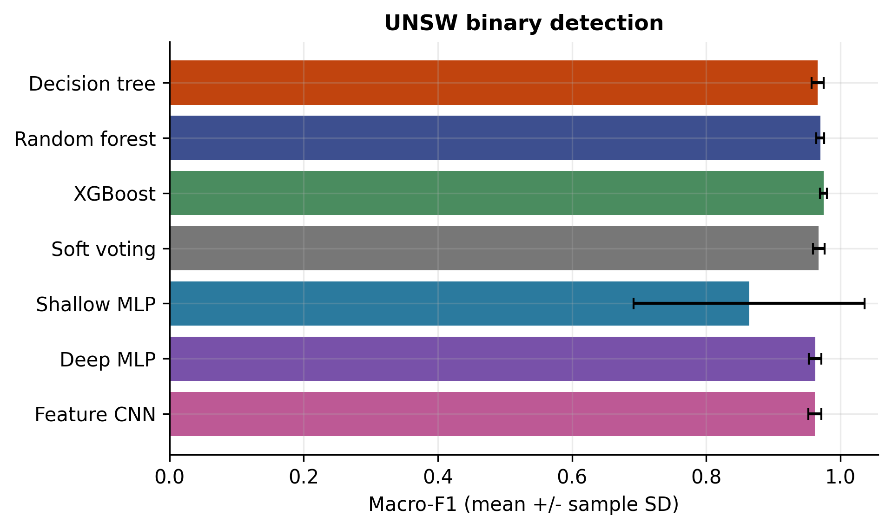

## Figure 4.13

UNSW binary false-alarm rate across seven detector families. Error bars show sample SD across seeds 7, 42 and 1337; 80,000 test flows per evaluation. These group-disjoint results are separate from the historical protocol in Figure 4.2.

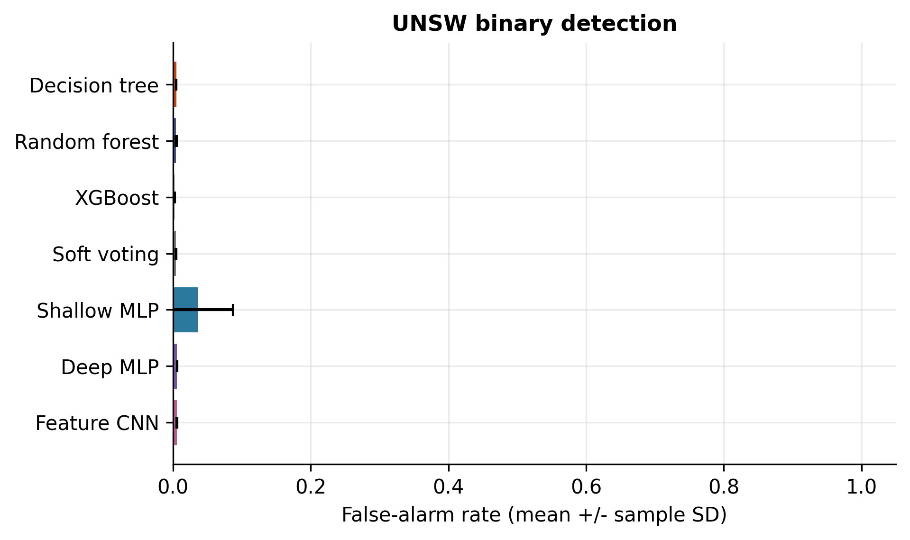

## Figure 4.14

IDS2018 binary macro-f1 across seven detector families. Error bars show sample SD across seeds 7, 42 and 1337; 80,000 test flows per evaluation. These group-disjoint results are separate from the historical protocol in Figure 4.2.

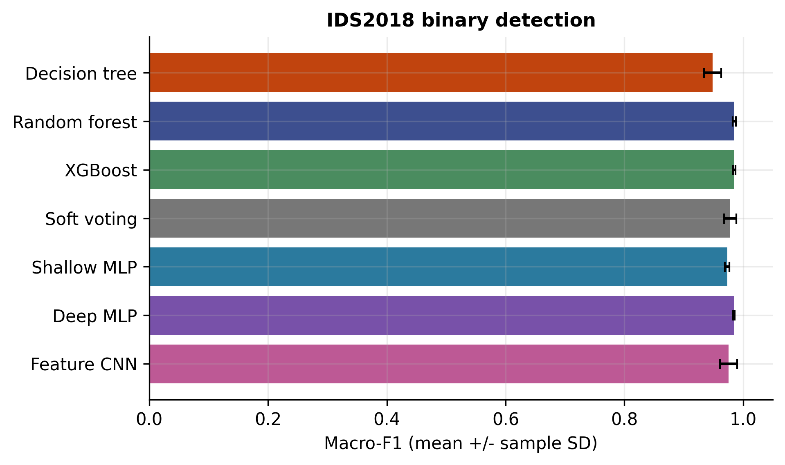

## Figure 4.15

IDS2018 binary false-alarm rate across seven detector families. Error bars show sample SD across seeds 7, 42 and 1337; 80,000 test flows per evaluation. These group-disjoint results are separate from the historical protocol in Figure 4.2.

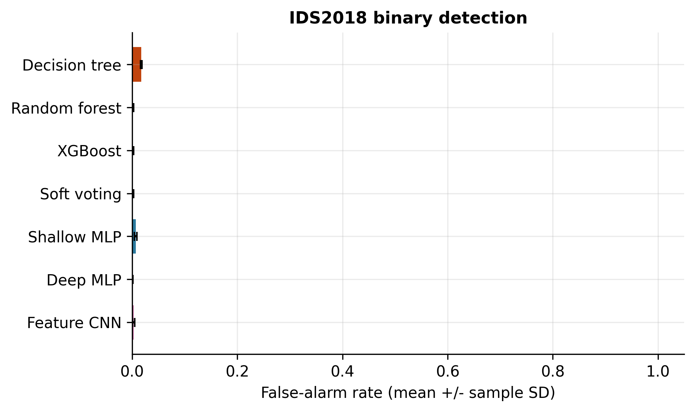

## Figure 4.16

UNSW multiclass macro-f1 across seven detector families. Error bars show sample SD across seeds 7, 42 and 1337; 80,000 test flows per evaluation. These group-disjoint results are separate from the historical protocol in Figure 4.2.

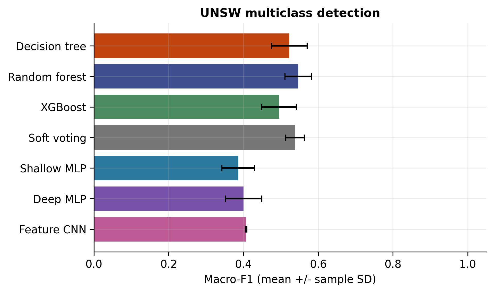

## Figure 4.17

UNSW multiclass false-alarm rate across seven detector families. Error bars show sample SD across seeds 7, 42 and 1337; 80,000 test flows per evaluation. These group-disjoint results are separate from the historical protocol in Figure 4.2.

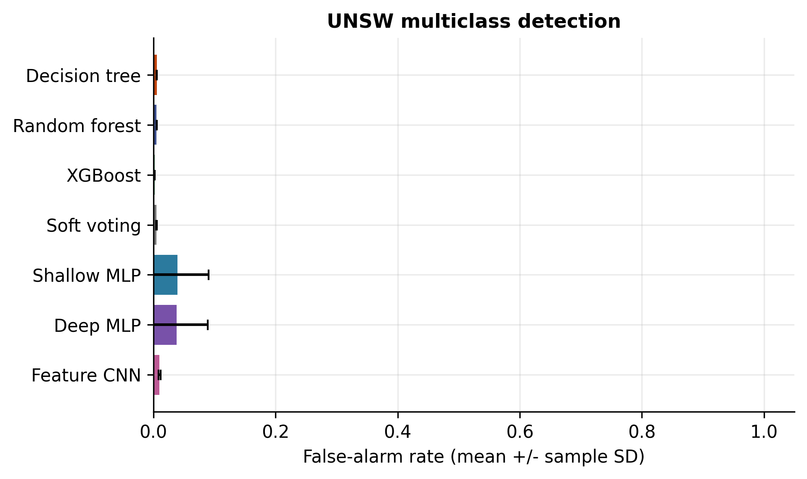

## Figure 4.18

IDS2018 multiclass macro-f1 across seven detector families. Error bars show sample SD across seeds 7, 42 and 1337; 80,000 test flows per evaluation. These group-disjoint results are separate from the historical protocol in Figure 4.2.

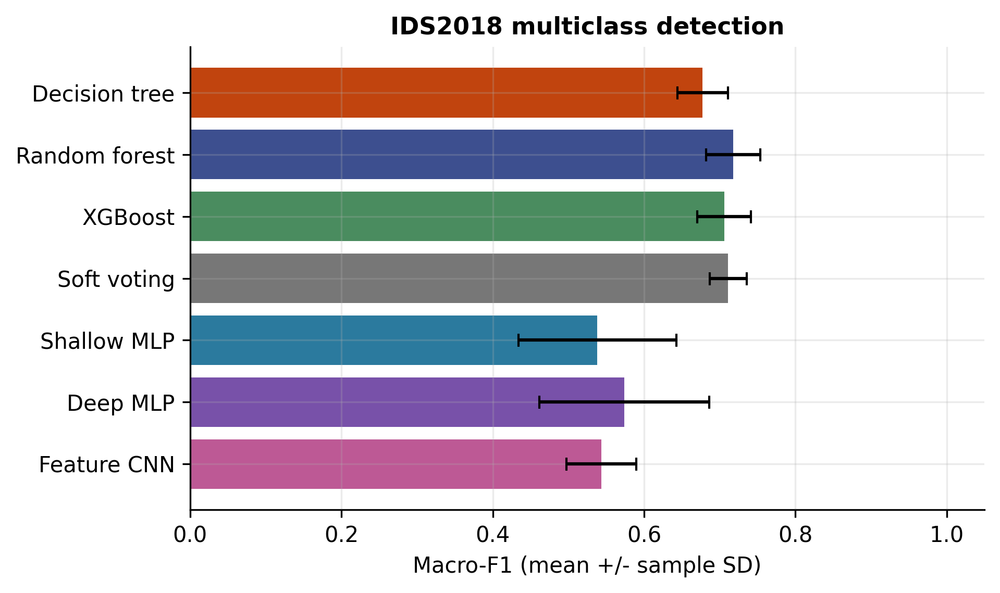

## Figure 4.19

IDS2018 multiclass false-alarm rate across seven detector families. Error bars show sample SD across seeds 7, 42 and 1337; 80,000 test flows per evaluation. These group-disjoint results are separate from the historical protocol in Figure 4.2.

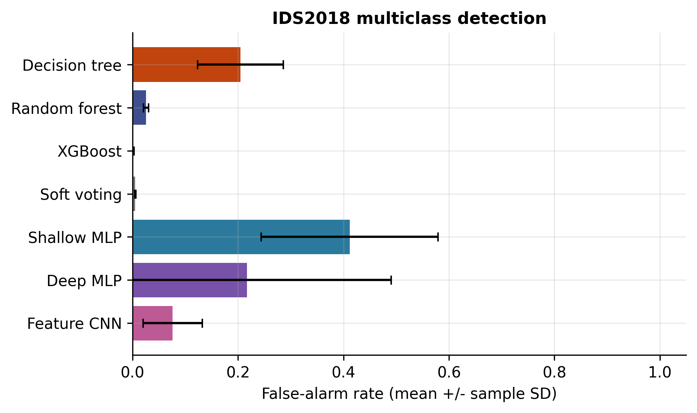

## Figure 4.20

Binary detection transfer from UNSW to IDS2018. All seven models are fitted on the source only; error bars represent three training seeds.

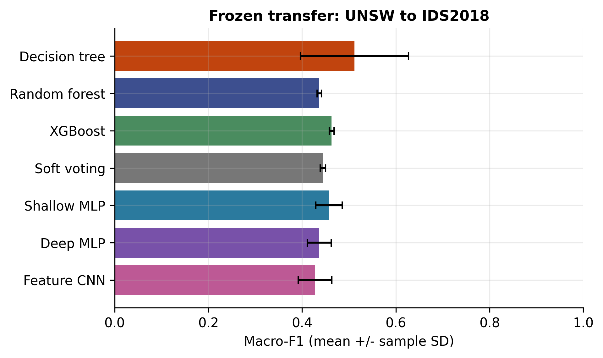

## Figure 4.21

Binary detection transfer from IDS2018 to UNSW. All seven models are fitted on the source only; error bars represent three training seeds.

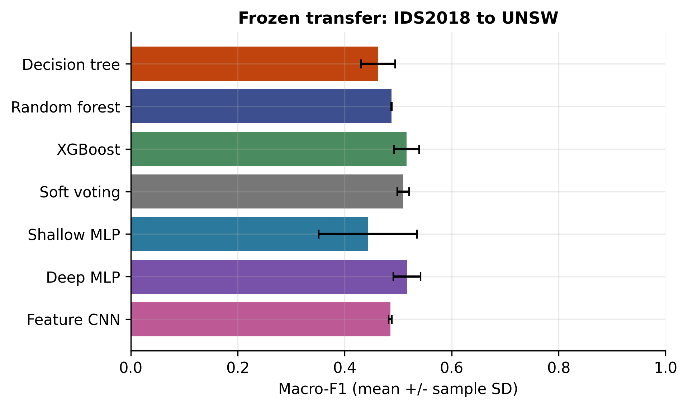

## Figure 4.22

DecisionTree: historical within-model stability versus random-controlled masking effect on 483 matched cases. Descriptive Spearman rho = 0.2037; this addresses a different question from the cross-model means in Figure 4.9.

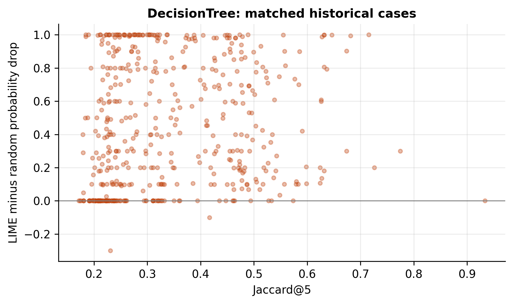

## Figure 4.23

RandomForest: historical within-model stability versus random-controlled masking effect on 483 matched cases. Descriptive Spearman rho = 0.2082; this addresses a different question from the cross-model means in Figure 4.9.

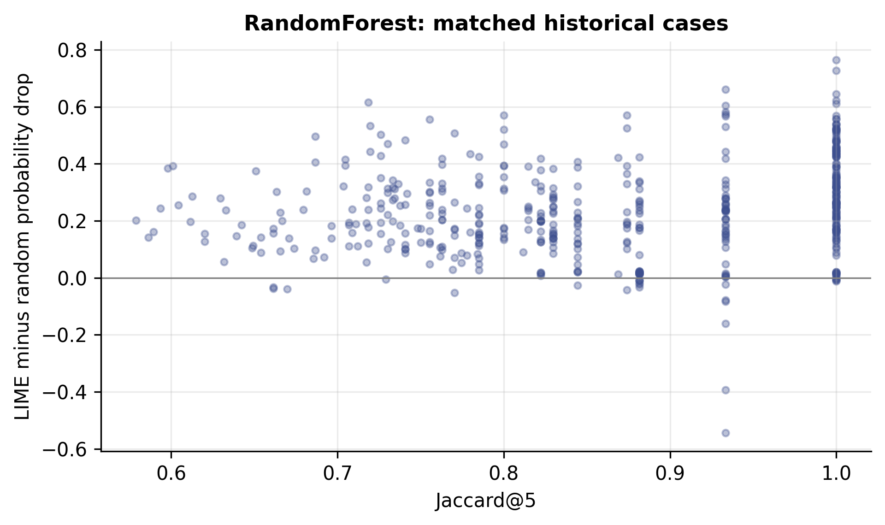

## Figure 4.24

XGBoost: historical within-model stability versus random-controlled masking effect on 483 matched cases. Descriptive Spearman rho = 0.2584; this addresses a different question from the cross-model means in Figure 4.9.

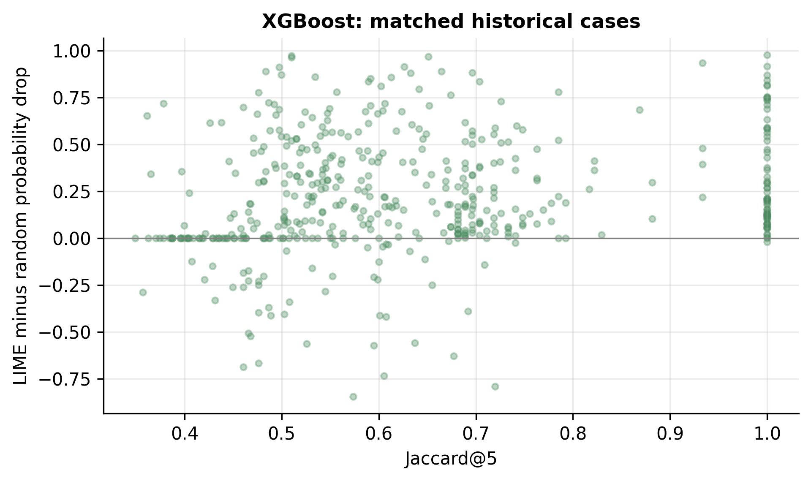

## Figure 4.25

Jaccard@5 for UNSW to UNSW: seed-42 detectors, 20 balanced unique-group cases, three LIME seeds, source-median masking and absolute attribution rankings. Mean pairwise set overlap across three explanation seeds.

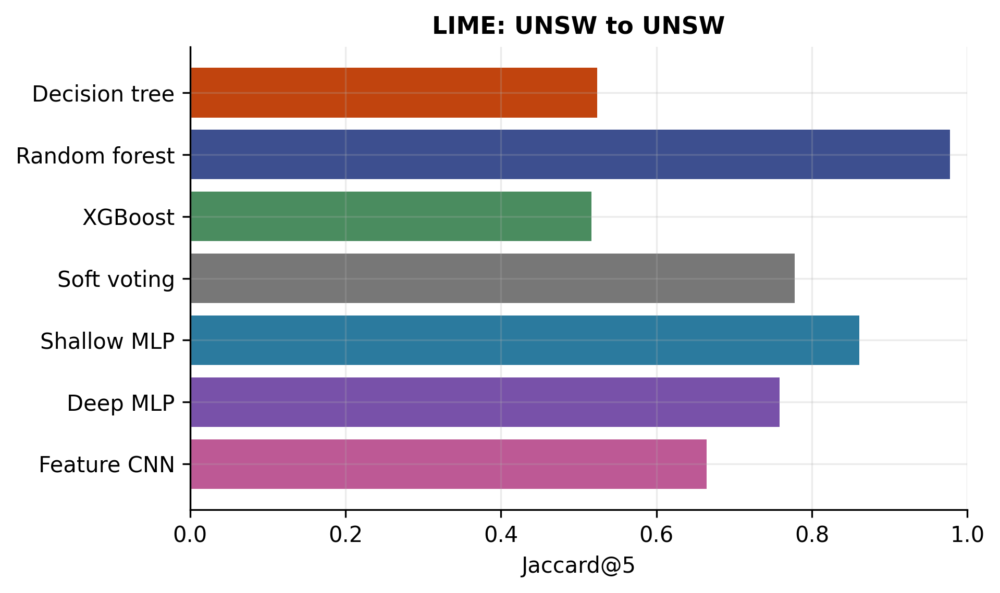

## Figure 4.26

LIME minus random probability drop for UNSW to UNSW: seed-42 detectors, 20 balanced unique-group cases, three LIME seeds, source-median masking and absolute attribution rankings. Intervals are 95% stratified bootstrap intervals over 20 cases, conditional on one fitted model; they are not training-seed uncertainty.

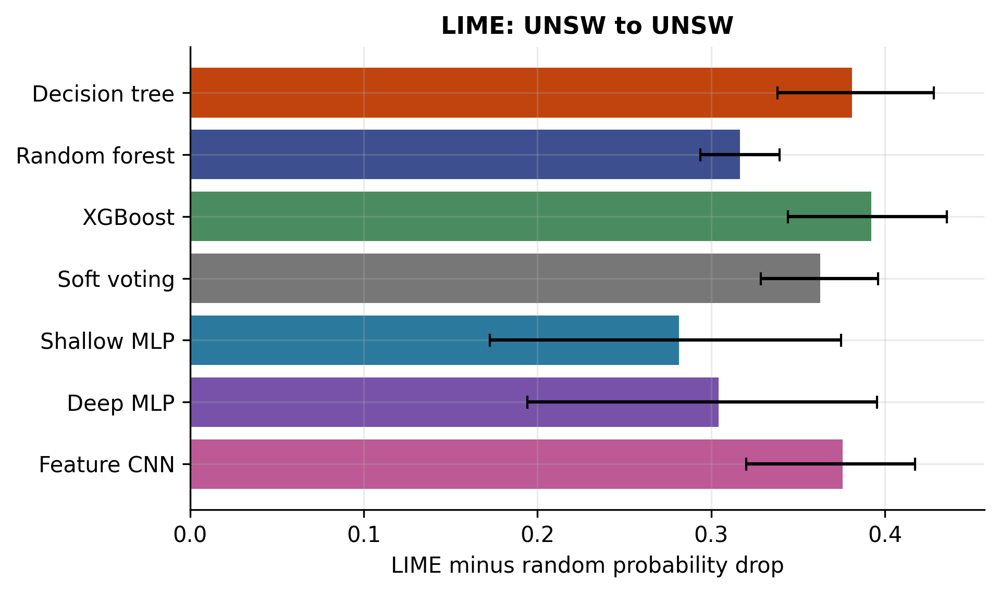

## Figure 4.27

Jaccard@5 for UNSW to IDS2018: seed-42 detectors, 20 balanced unique-group cases, three LIME seeds, source-median masking and absolute attribution rankings. Mean pairwise set overlap across three explanation seeds.

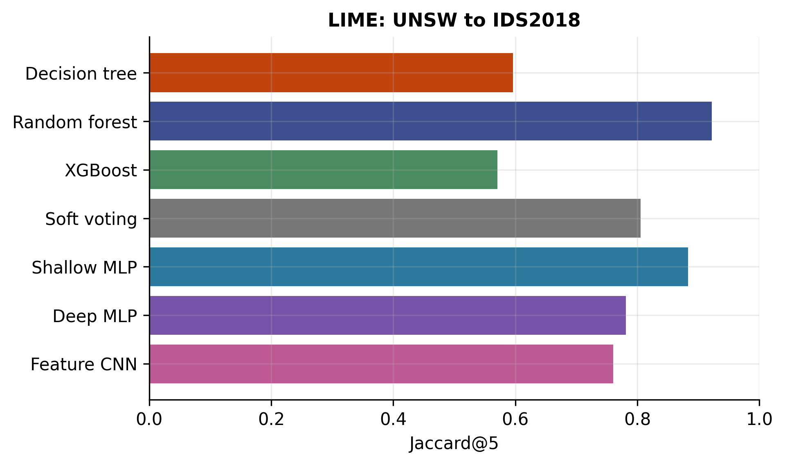

## Figure 4.28

LIME minus random probability drop for UNSW to IDS2018: seed-42 detectors, 20 balanced unique-group cases, three LIME seeds, source-median masking and absolute attribution rankings. Intervals are 95% stratified bootstrap intervals over 20 cases, conditional on one fitted model; they are not training-seed uncertainty.

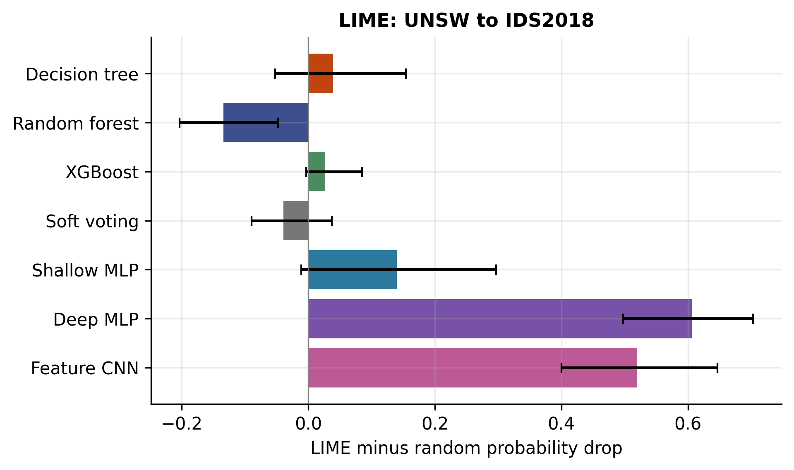

## Figure 4.29

Jaccard@5 for IDS2018 to UNSW: seed-42 detectors, 20 balanced unique-group cases, three LIME seeds, source-median masking and absolute attribution rankings. Mean pairwise set overlap across three explanation seeds.

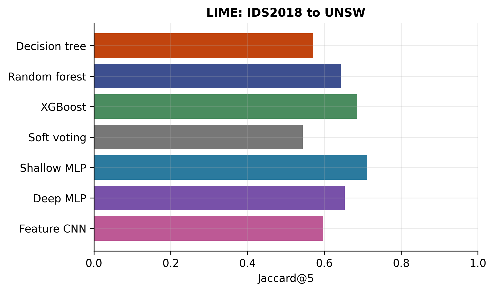

## Figure 4.30

LIME minus random probability drop for IDS2018 to UNSW: seed-42 detectors, 20 balanced unique-group cases, three LIME seeds, source-median masking and absolute attribution rankings. Intervals are 95% stratified bootstrap intervals over 20 cases, conditional on one fitted model; they are not training-seed uncertainty.

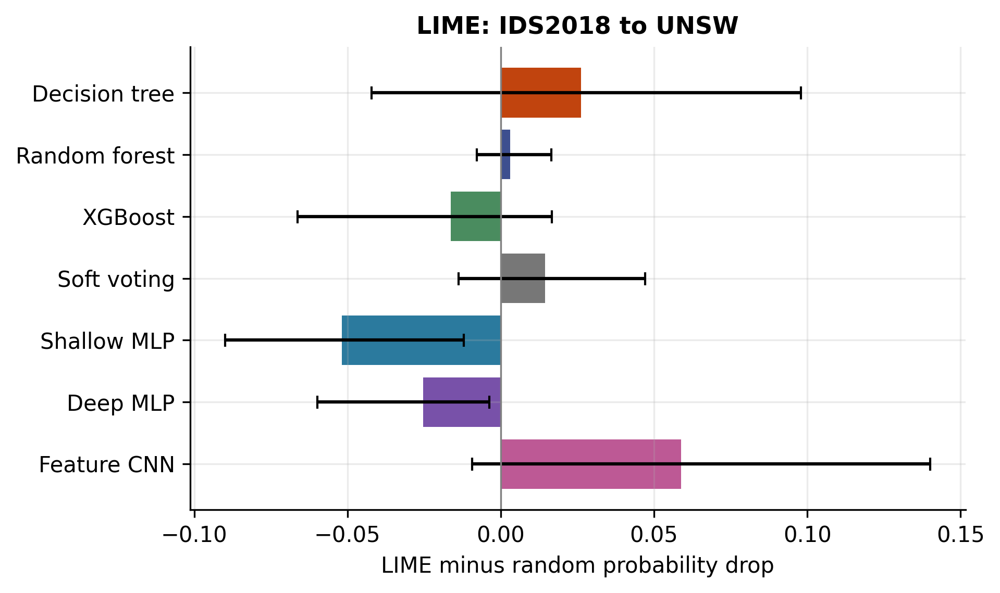

## Figure 4.31

Jaccard@5 for IDS2018 to IDS2018: seed-42 detectors, 20 balanced unique-group cases, three LIME seeds, source-median masking and absolute attribution rankings. Mean pairwise set overlap across three explanation seeds.

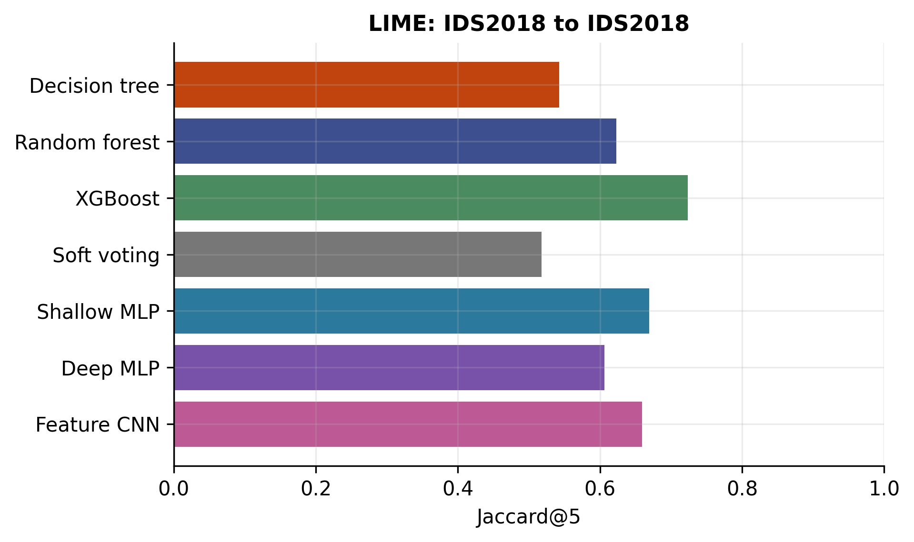

## Figure 4.32

LIME minus random probability drop for IDS2018 to IDS2018: seed-42 detectors, 20 balanced unique-group cases, three LIME seeds, source-median masking and absolute attribution rankings. Intervals are 95% stratified bootstrap intervals over 20 cases, conditional on one fitted model; they are not training-seed uncertainty.

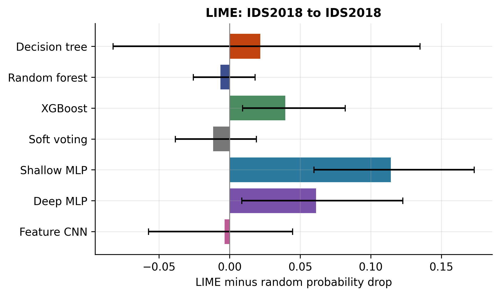

## Figure 4.33

Valid own explanations out of all 80 requested outputs per model. Coverage must accompany any masking score calculated only on valid explanations.

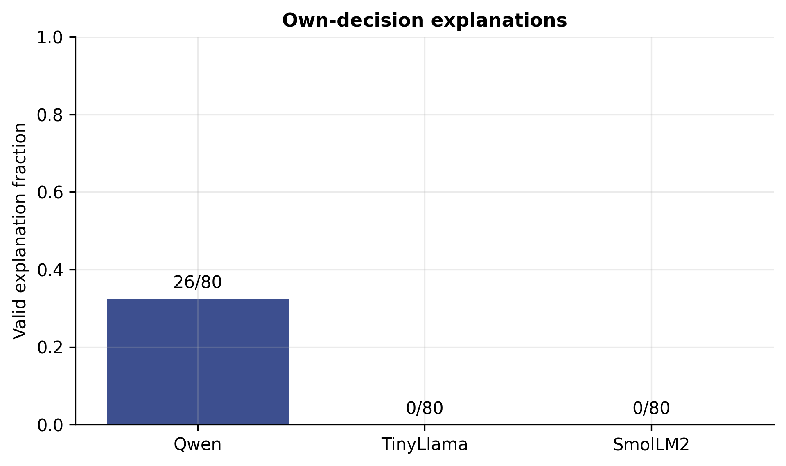

## Figure 4.34

Valid detector explanations out of all 80 requested outputs per model. Coverage must accompany any masking score calculated only on valid explanations.

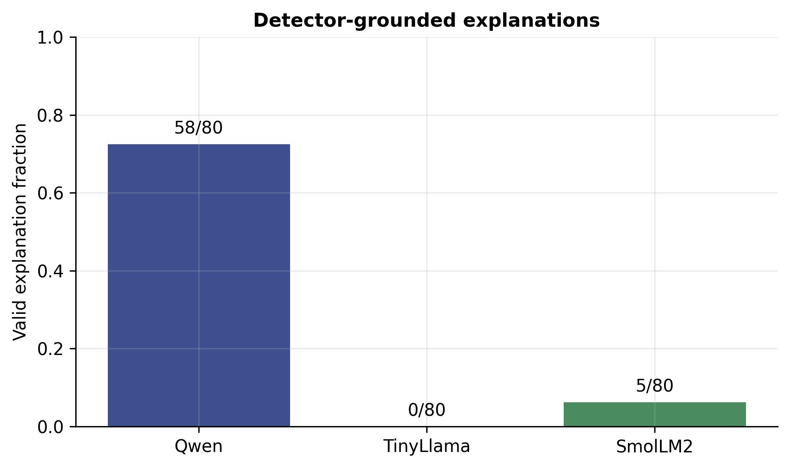