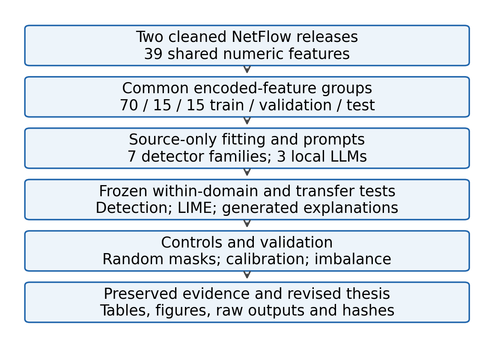
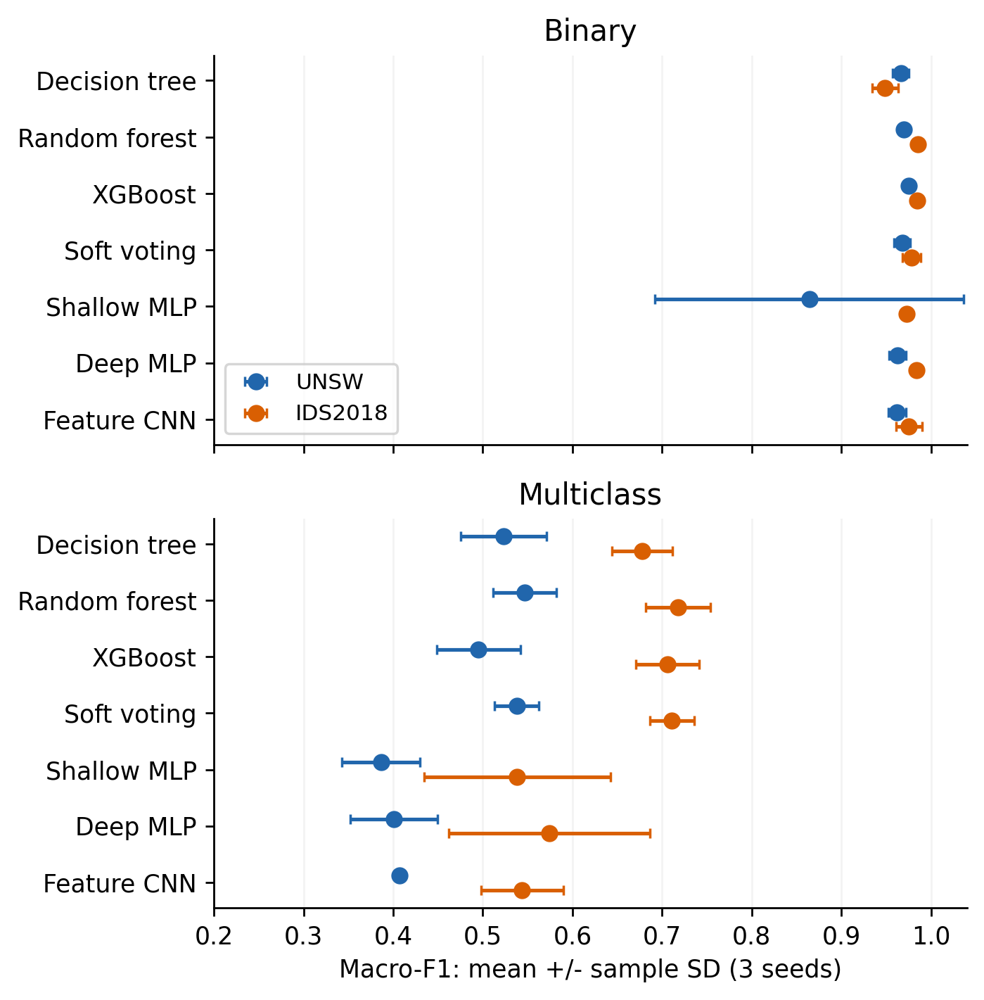
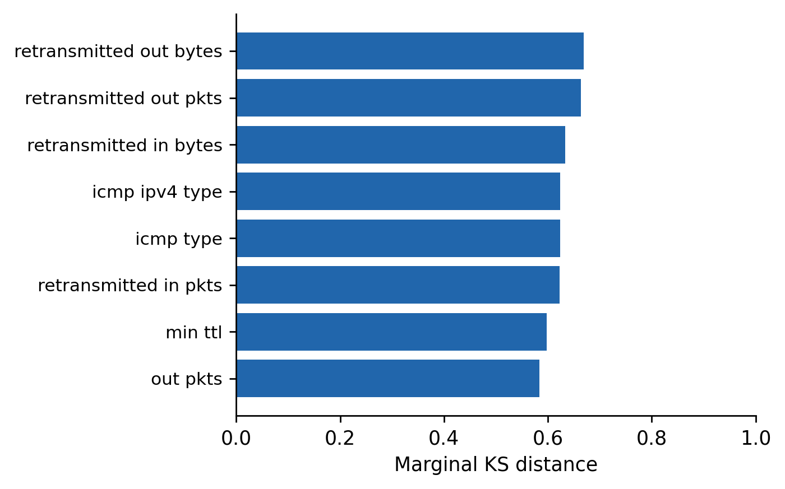
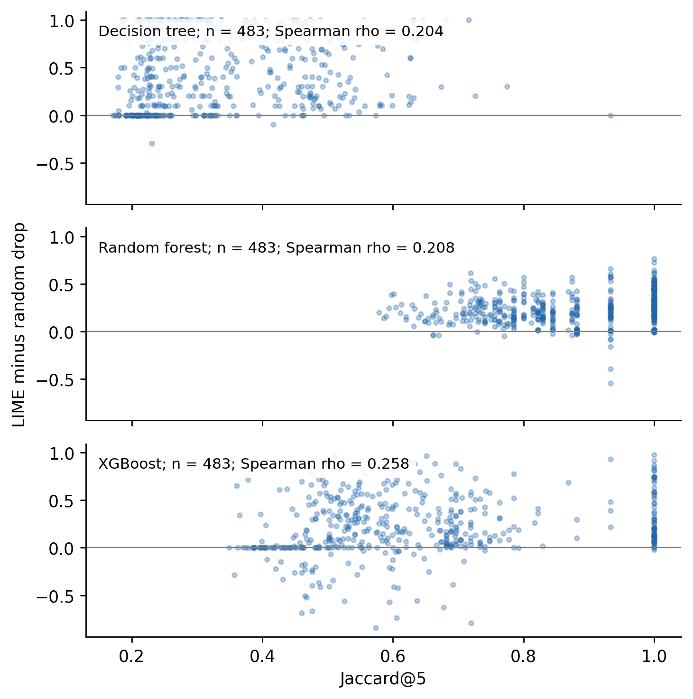
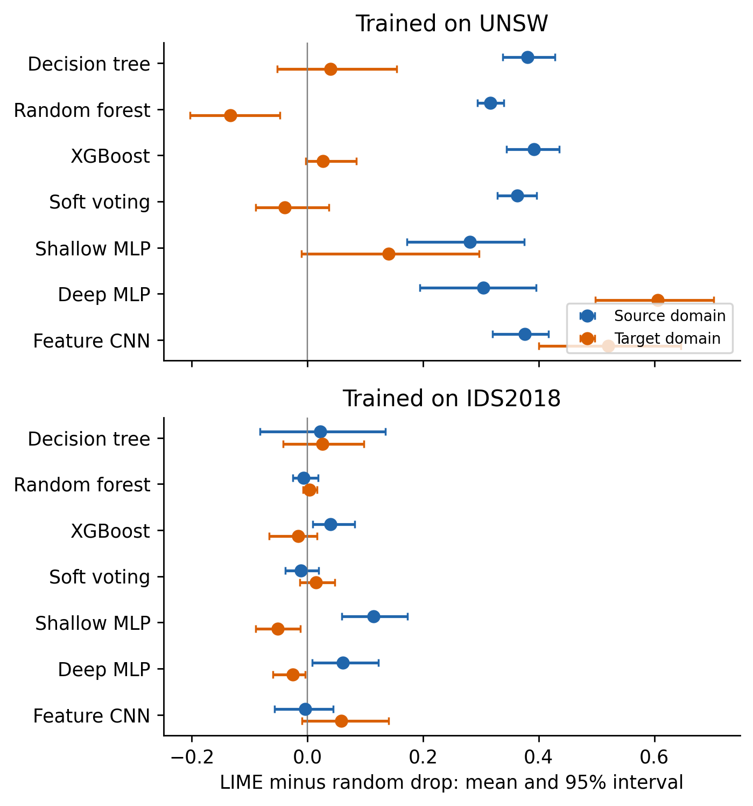
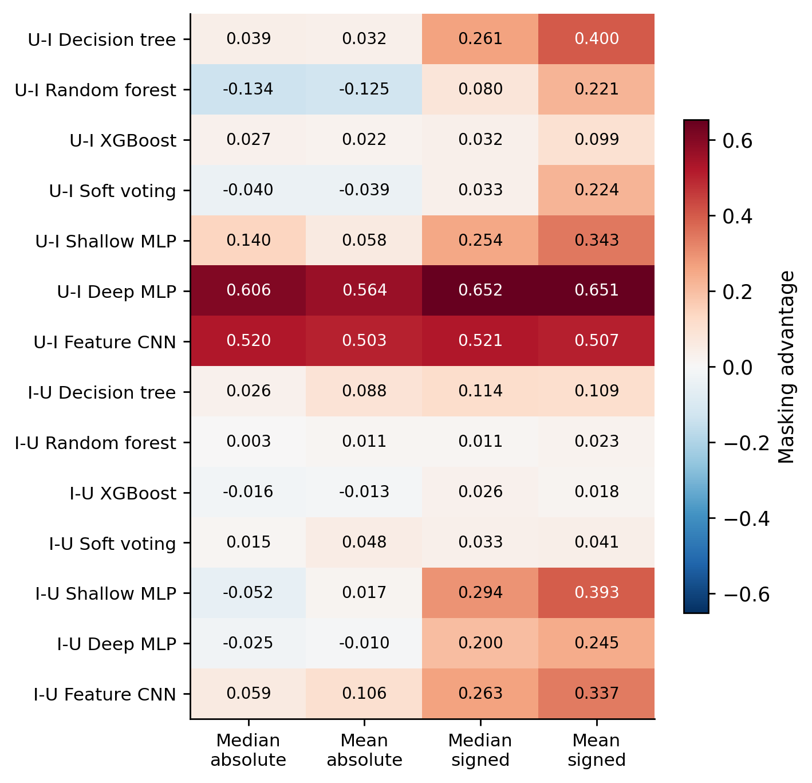
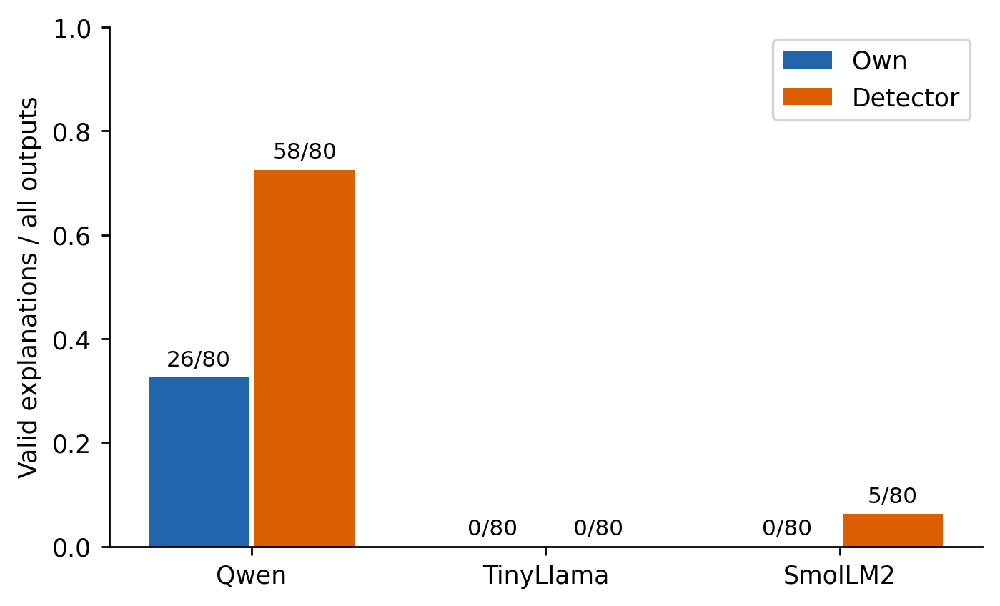
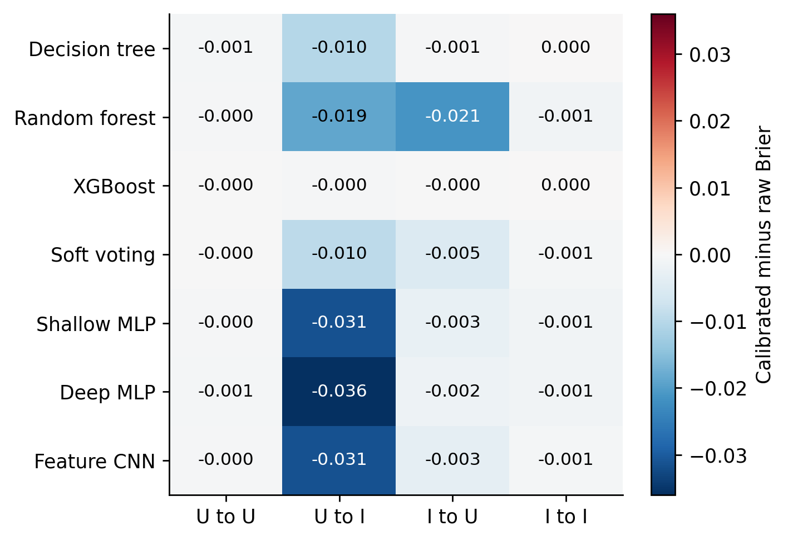
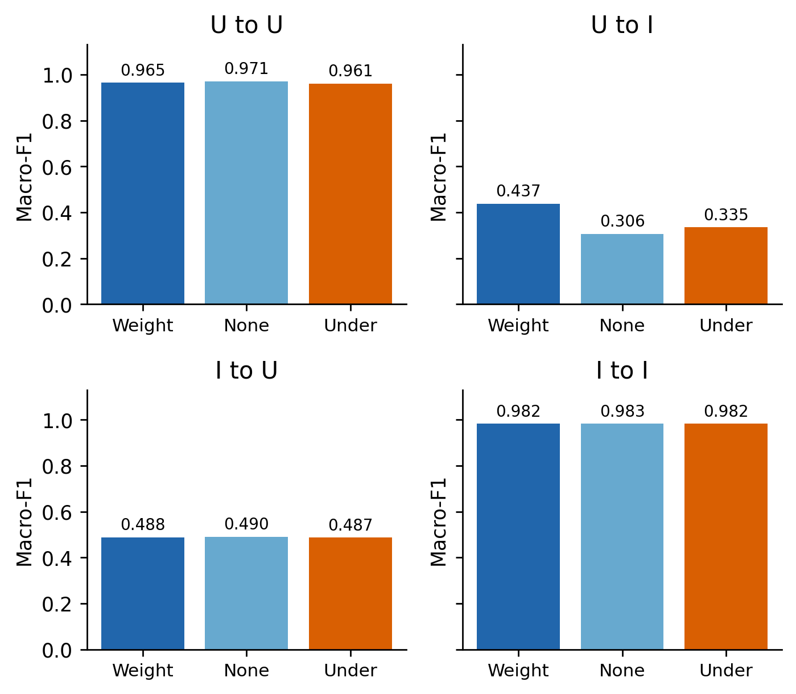

# Thesis report artifacts

The revised five-chapter thesis is built from completed study results. See [revision notes](../../../docs/THESIS_REVISION.md), [editable manuscript](../../../thesis/manuscript.md) and [PDF](../../../output/pdf/thesis_xai_ids.pdf).

`input_manifest.json` records the source hashes used by the report. `pdf_structure_check.json` records the final PDF hash, page geometry, chapter starts and structural checks. Visual inspection is recorded separately in `verification.json` after final rendering.

## Figures

Source-only fitting and held-out evaluation; the completed report follows retained evidence.

Mean and sample SD over three training/split seeds. Native multiclass taxonomies differ.

Largest eight observed marginal KS distances on 20,000 held-out rows per domain. Descriptive, not causal.

483 historical cases per model; within-model associations are distinct from cross-model ordering.

Conditional stratified-bootstrap intervals over 20 balanced unique groups per domain, after averaging three LIME seeds. One training seed; no multiplicity adjustment.

All four baseline/ranking variants retained. U-I means UNSW to IDS2018; I-U is the reverse. Signed ranking can include nonpositive coefficients.

Valid responses divided by all generated responses, aggregated over four directions. Schema validity does not establish prose truth.

Source-validation temperature scaling; negative Brier differences mean improvement. Seed 42 only.

Random forest: balanced weights, no weights and training-only undersampling, with unchanged test prevalence. Seed 42 only.
